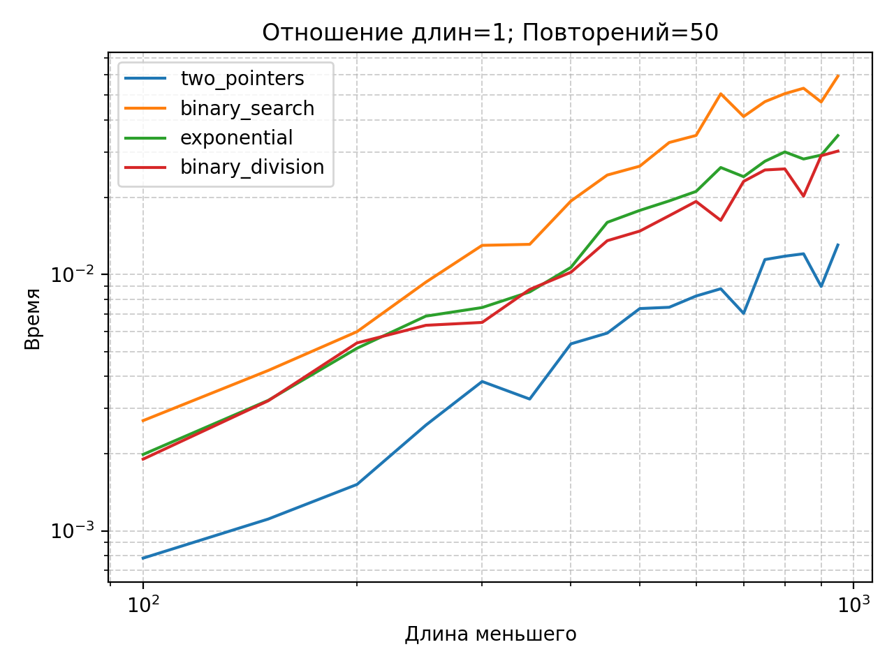
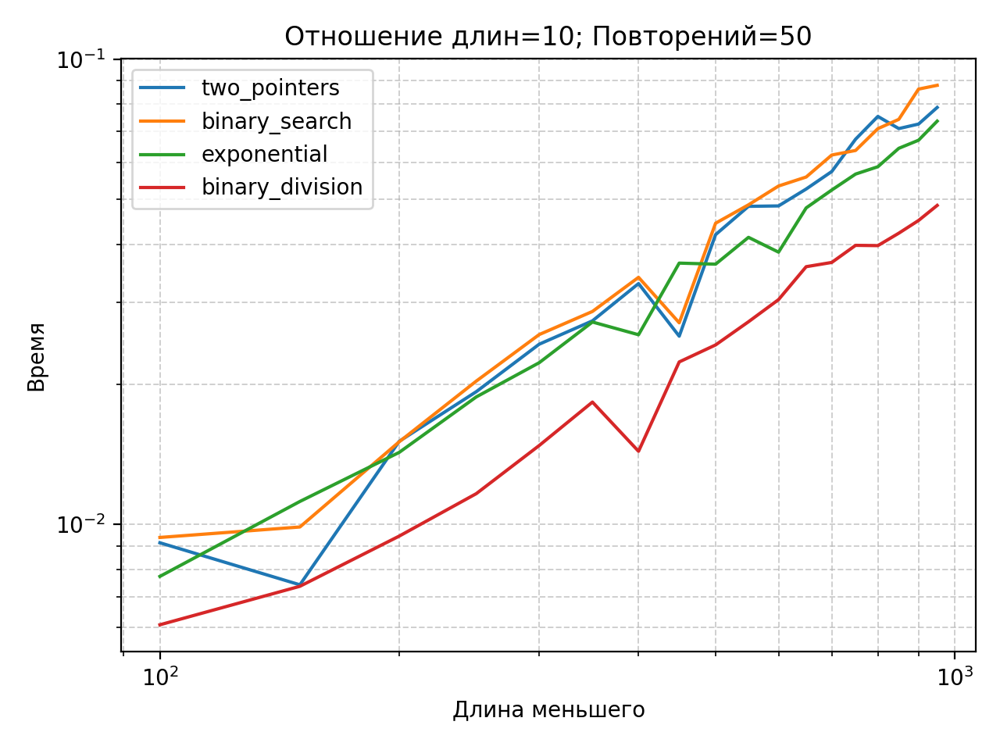
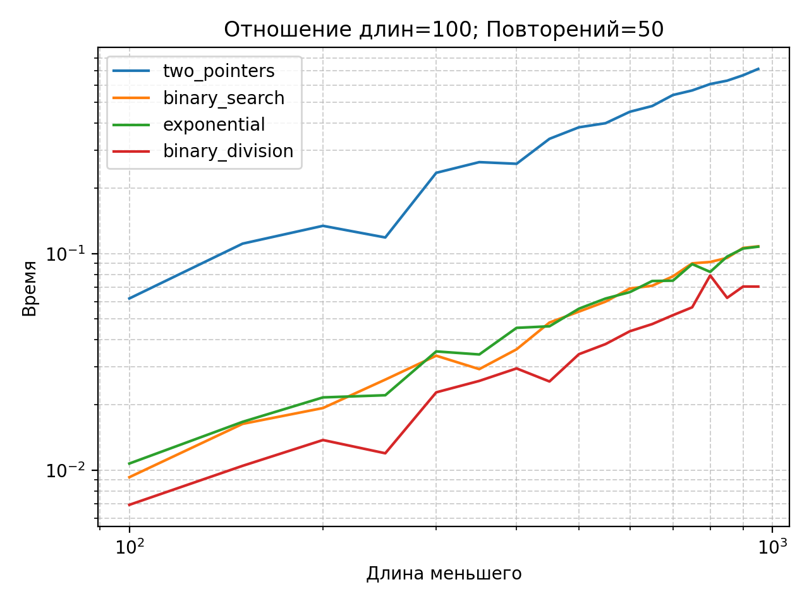
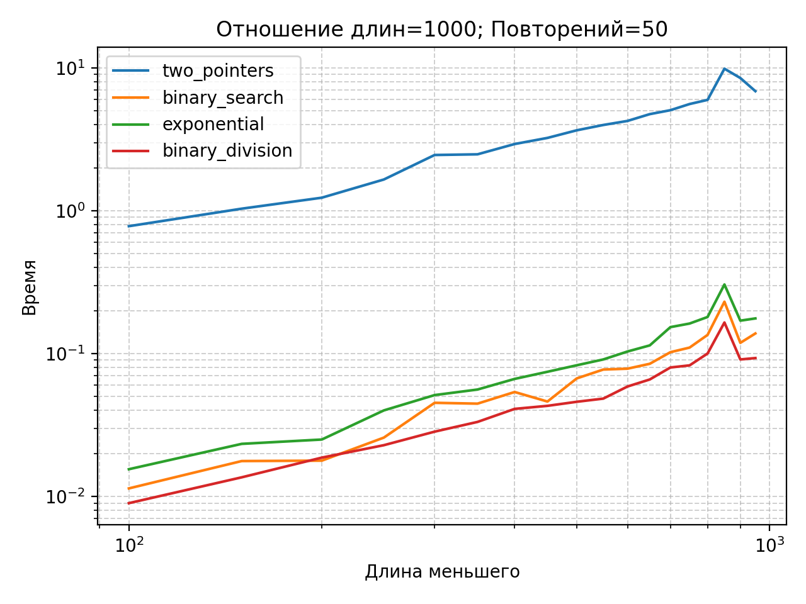

## Генерация данных  

С помощью арифметической прогрессии для каждого n делаются два массива разной четности, равномерно распределенные

---

## Методика измерений

- таймер: perf_counter()
- для каждой пары (n, ratio) алгоритм запускался repeats раз
- фиксировали суммарное время за repeats
- брали несколько значений ratio: 1, 10, 100, 1000
- строили графики с экспоненциальными осями:
- по X: длина меньшего массива
- по Y: время

Параметры перебора n: от 100 до 1000 с шагом 50

---

## Результаты по графикам (repeats=50)

### 1) ratio = 1

- two_pointer самый быстрый
- среди остальных лучше всего binary_division
- binary_search самый медленный

---

### 2) ratio = 10

- binary_division начинает выигрывать, особенно на больших n
- exponential обычно второе место
- two_pointers на последнем месте вместе с binary_search

---

### 3) ratio = 100

- two_pointers становится на порядок медленнее остальных (очень заметно)
- binary_division лучший
- binary_search и exponential примерно рядом

---

### 4) ratio = 1000

- two_pointers улетает вверх (очень медленно)
- лучший — binary_division
- binary_search и exponential остаются быстрыми, но хуже binary_division

---

## Итог
1. Если длины примерно одинаковые, то лучший выбор - two_pointers
2. На больших ratio самый стабильный победитель - binary_division_method
3. binary_search_method и exponential_method просты в реализации, подходят для больших ratio, но обычно уступают binary_division

---
